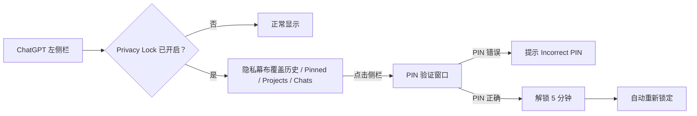

# ChatGPT Privacy Lock

> **CONFIDENTIAL — Private source code**<br>
> Copyright © 2026 Marcel ([@Marcel330-ait](https://github.com/Marcel330-ait)). All rights reserved.<br>
> Personal, private, non-commercial use only. See [CONFIDENTIAL_NOTICE.txt](CONFIDENTIAL_NOTICE.txt).

一个 Chrome Manifest V3 扩展：在不影响当前对话、输入框或发送按钮的前提下，保护 ChatGPT 左侧栏中可能暴露隐私的聊天历史、Pinned、Projects、Library 和 Search chats。

## 工作效果



锁定后的侧栏布局：

```text
┌──────────────────────── ChatGPT 左侧栏 ────────────────────────┐
│  New chat                                        ← 保持可用     │
│  ─────────────────  🔒 Sidebar history locked  ──────────────  │
│  Search chats / Library                                          │
│  Pinned 聊天名称                                                  │
│  Projects 项目名称                                                │
│  Chats 历史对话                                                   │
│                                                                  │
│  点击幕布 → 输入 PIN → 临时解锁 5 分钟                           │
└──────────────────────────────────────────────────────────────────┘

主聊天区域、当前对话、消息输入框和发送按钮不会被遮挡或拦截。

## 安装

1. 在 Chrome 地址栏打开 `chrome://extensions`。
2. 打开右上角的 **开发者模式**。
3. 点击 **加载已解压的扩展程序**。
4. 选择本项目文件夹 `chatgpt-privacy-lock`。
5. 打开 [chatgpt.com](https://chatgpt.com) 或 `chat.openai.com`。

## 首次设置与使用

1. 点击 Chrome 工具栏中的扩展图标，打开 **ChatGPT Privacy Lock**。
2. 在 **Set a PIN** 输入至少 4 位的 PIN。
3. 开启 **Sidebar protection**。
4. 点击 **Save settings**。字段变为 **Change PIN (optional)** 即表示 PIN 已保存。
5. 刷新 ChatGPT 页面。
6. 点击扩展弹窗中的 **Lock Now**，或等待下一次页面加载自动锁定。

锁定后侧栏顶部会显示 **🔒 History locked**。点击被遮住的侧栏区域，输入正确 PIN 后可解锁 5 分钟；到期会自动重新锁定。

## 更新本地代码后

Chrome 不会自动读取修改后的本地文件。每次编辑本项目后：

1. 到 `chrome://extensions` 点击本扩展的刷新按钮 `↻`。
2. 回到 ChatGPT，按 `Ctrl + R` 刷新页面。

## 项目结构

| 文件 | 作用 |
| --- | --- |
| `manifest.json` | Manifest V3 配置和 ChatGPT 页面匹配范围 |
| `content.js` | 侧栏识别、遮罩、PIN 验证、五分钟解锁和点击拦截 |
| `styles.css` | 模糊/遮罩、锁定徽章、隐私幕布和 PIN 弹窗样式 |
| `popup.html` / `popup.js` | 扩展弹窗、PIN 设置、开关和 Lock Now |
| `CONFIDENTIAL_NOTICE.txt` | 权属、保密与非商业使用声明 |

## 隐私与安全边界

这是一层面对肩窥和临时借用电脑场景的隐私 UX，不替代 ChatGPT 账号密码、设备锁屏、浏览器配置文件保护或账户级安全措施。PIN 和锁定状态存储在 `chrome.storage.local`。

## 权利声明

本项目为 Marcel 的私有、保密代码，未授予开源许可。禁止未经书面授权的商业使用、销售、分发、再授权或公开发布。
