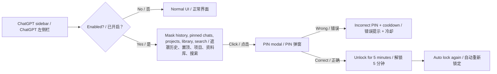

# ChatGPT Privacy Lock

> **PROPRIETARY AND CONFIDENTIAL — Private source code**<br>
> Copyright © 2026 Marcel ([@Marcel330-ait](https://github.com/Marcel330-ait)). All rights reserved.<br>
> Personal, private, non-commercial use only. See [CONFIDENTIAL_NOTICE.txt](CONFIDENTIAL_NOTICE.txt).

**中文**：一个 Chrome Manifest V3 扩展，用来保护 ChatGPT 左侧栏里的聊天历史、Pinned、Projects、Library 和 Search chats，同时不影响当前对话、消息输入框或发送按钮。

**English**: A Chrome Manifest V3 extension that protects ChatGPT sidebar history, pinned chats, projects, library, and search—without affecting the active conversation, message composer, or send button.

## 功能亮点 / Highlights

| 中文 | English |
| --- | --- |
| 遮罩/模糊会暴露历史记录的侧边栏区域 | Masks sidebar areas that reveal history or project names |
| 当前聊天、输入框、发送按钮保持可用 | Keeps the active chat, composer, and send button usable |
| PIN 正确后临时解锁 5 分钟 | Unlocks for 5 minutes after a correct PIN |
| 切换页面或窗口失焦时自动重新锁定 | Re-locks when the page is hidden or the window loses focus |
| PIN 使用 PBKDF2 + 随机 salt 存储 | Stores PIN with PBKDF2 + a random salt |
| 错误 PIN 多次后进入短暂冷却 | Adds a short cooldown after repeated incorrect PIN attempts |
| 可手动选择 Auto / 中文 / English | Lets users choose Auto / Chinese / English manually |
| 可选择隐藏 Search、Library、Pinned、Projects、Chats | Lets users choose which sidebar areas to hide |

## 工作原理 / How it works



锁定后的侧边栏布局 / Locked sidebar layout:

```text
┌──────────── ChatGPT sidebar / 左侧栏 ────────────┐
│ New chat                         ← remains usable │
│ ─────── 🔒 Sidebar history locked ─────────────── │
│ Search chats / Library                            │
│ Pinned chat names / 置顶聊天名                    │
│ Project names / 项目名                            │
│ Previous chats / 历史聊天                         │
│                                                   │
│ Click curtain → enter PIN → unlock for 5 min      │
│ 点击幕布 → 输入 PIN → 解锁 5 分钟                 │
└───────────────────────────────────────────────────┘
```

## 安装 / Installation

1. **中文**：在 Chrome 地址栏打开 `chrome://extensions`。<br>
   **English**: Open `chrome://extensions` in Chrome.
2. **中文**：打开右上角的 **开发者模式**。<br>
   **English**: Turn on **Developer mode** in the upper-right corner.
3. **中文**：点击 **加载已解压的扩展程序**。<br>
   **English**: Click **Load unpacked**.
4. **中文**：选择本项目文件夹 `B:\chatgpt-privacy-lock`。<br>
   **English**: Select this project folder: `B:\chatgpt-privacy-lock`.
5. **中文**：打开 [chatgpt.com](https://chatgpt.com) 或 `chat.openai.com`。<br>
   **English**: Open [chatgpt.com](https://chatgpt.com) or `chat.openai.com`.

## 首次设置 / First-time setup

1. **中文**：点击 Chrome 工具栏里的扩展图标，打开 **ChatGPT Privacy Lock**。<br>
   **English**: Click the extension icon in Chrome's toolbar and open **ChatGPT Privacy Lock**.
2. **中文**：在 **设置 PIN / Set a PIN** 输入至少 4 位字符。<br>
   **English**: Enter a PIN with at least 4 characters.
3. **中文**：开启 **侧边栏保护 / Sidebar protection**。<br>
   **English**: Turn on **Sidebar protection**.
4. **中文**：选择语言：**Auto / 中文 / English**。<br>
   **English**: Choose a language: **Auto / 中文 / English**.
5. **中文**：勾选你想隐藏的侧边栏区域：Search chats、Library、Pinned chats、Projects、Previous chats。<br>
   **English**: Select the sidebar areas you want to hide: Search chats, Library, Pinned chats, Projects, Previous chats.
6. **中文**：点击 **保存设置 / Save settings**。<br>
   **English**: Click **Save settings**.
7. **中文**：刷新 ChatGPT 页面，或在 `chrome://extensions` 里重载扩展后再刷新页面。<br>
   **English**: Refresh ChatGPT, or reload the extension in `chrome://extensions` and then refresh the page.

## 日常使用 / Daily use

- **中文**：锁定时会显示 **🔒 History locked / 历史已锁定**，侧边栏历史区域会被遮罩。<br>
  **English**: When locked, **🔒 History locked** appears and sidebar history areas are masked.
- **中文**：点击被保护区域会弹出 PIN 输入框。PIN 正确后，侧边栏解锁 5 分钟。<br>
  **English**: Clicking a protected area opens a PIN dialog. A correct PIN unlocks the sidebar for 5 minutes.
- **中文**：点击弹窗里的 **Lock Now / 立即锁定** 可以马上重新锁定。<br>
  **English**: Click **Lock Now** in the popup to re-lock immediately.
- **中文**：切走页面、切换标签页、窗口失焦，都会自动锁回去。<br>
  **English**: Switching tabs, hiding the page, or losing window focus re-locks the sidebar.
- **中文**：如果你只想隐藏 Projects 或 Previous chats，可以在弹窗里取消其它区域。<br>
  **English**: If you only want to hide Projects or Previous chats, uncheck the other areas in the popup.

## 文件结构 / Project structure

| File | 中文说明 | English |
| --- | --- | --- |
| `manifest.json` | Manifest V3 配置、权限、图标和 ChatGPT 匹配范围 | MV3 config, permissions, icons, and ChatGPT match patterns |
| `content.js` | 侧边栏识别、按区域遮罩、点击拦截、PIN 验证、自动锁定 | Sidebar detection, per-area masking, click interception, PIN verification, auto lock |
| `popup.html` / `popup.js` | 扩展弹窗、PIN 设置、语言选择、隐藏范围、倒计时状态、立即锁定 | Popup, PIN setup, language picker, protected-area choices, countdown status, Lock Now |
| `styles.css` | 遮罩、徽章、弹窗和弹窗 UI 样式 | Mask, badge, modal, and popup styles |
| `_locales/` | 中英双语文案 | Chinese/English localization strings |
| `PRIVACY_POLICY.md` | 隐私政策草案 | Privacy policy draft |
| `CHANGELOG.md` | 版本变更记录 | Version changelog |
| `CONFIDENTIAL_NOTICE.txt` | 权属、保密与非商业使用声明 | Ownership, confidentiality, and non-commercial-use notice |

## 隐私与安全边界 / Privacy and security scope

**中文**：这是面对肩窥和临时借用电脑场景的隐私 UX 层，不替代 ChatGPT 账号安全、设备锁屏、浏览器配置文件保护或账户级安全措施。扩展不会读取、上传或保存你的聊天内容。PIN 派生值和锁定状态仅存储在 `chrome.storage.local`。

**English**: This is a privacy UX layer for shoulder-surfing and casual-access scenarios. It does not replace ChatGPT account security, device locking, browser-profile protection, or account-level security. The extension does not read, upload, or store your chat contents. PIN-derived data and lock state are stored only in `chrome.storage.local`.

## 发布前清单 / Release checklist

See [docs/RELEASE_CHECKLIST.md](docs/RELEASE_CHECKLIST.md).

## 权利声明 / Rights notice

**中文**：本项目为 Marcel 的私有、保密代码，未授予开源许可。禁止未经书面授权的商业使用、销售、分发、再授权或公开发布。

**English**: This project is Marcel's private and confidential code. No open-source license is granted. Commercial use, sale, distribution, sublicensing, or public release is prohibited without prior written permission.
