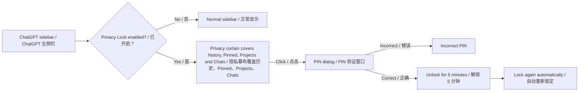

# ChatGPT Privacy Lock

> **CONFIDENTIAL — Private source code**<br>
> Copyright © 2026 Marcel ([@Marcel330-ait](https://github.com/Marcel330-ait)). All rights reserved.<br>
> Personal, private, non-commercial use only. See [CONFIDENTIAL_NOTICE.txt](CONFIDENTIAL_NOTICE.txt).

**中文**：一个 Chrome Manifest V3 扩展，用于保护 ChatGPT 左侧栏中的聊天历史、Pinned、Projects、Library 和 Search chats，同时不影响当前对话、输入框或发送按钮。

**English**: A Chrome Manifest V3 extension that protects ChatGPT sidebar history, pinned chats, projects, library, and search—without affecting the active conversation, composer, or send button.

## 工作原理 / How it works



锁定后的侧栏布局 / Locked sidebar layout:

```text
┌────────────────────── ChatGPT sidebar / 左侧栏 ──────────────────────┐
│  New chat                                      ← remains usable / 可用 │
│  ───────────────── 🔒 Sidebar history locked ────────────────────── │
│  Search chats / Library                                               │
│  Pinned chat names / Pinned 聊天名称                                  │
│  Project names / Projects 项目名称                                    │
│  Previous chats / 历史对话                                            │
│                                                                        │
│  Click curtain → enter PIN → unlock for 5 min                         │
│  点击幕布 → 输入 PIN → 临时解锁 5 分钟                                │
└────────────────────────────────────────────────────────────────────────┘
```

**中文**：主聊天区域、当前对话、消息输入框和发送按钮不会被遮挡或拦截。<br>
**English**: The main conversation area, active chat, message composer, and send button are never masked or blocked.

## 安装 / Installation

1. **中文**：在 Chrome 地址栏打开 `chrome://extensions`。<br>
   **English**: Open `chrome://extensions` in Chrome.
2. **中文**：打开右上角的 **开发者模式**。<br>
   **English**: Turn on **Developer mode** in the upper-right corner.
3. **中文**：点击 **加载已解压的扩展程序**。<br>
   **English**: Click **Load unpacked**.
4. **中文**：选择本项目文件夹 `chatgpt-privacy-lock`。<br>
   **English**: Select this project folder, `chatgpt-privacy-lock`.
5. **中文**：打开 [chatgpt.com](https://chatgpt.com) 或 `chat.openai.com`。<br>
   **English**: Open [chatgpt.com](https://chatgpt.com) or `chat.openai.com`.

## 首次设置与使用 / First-time setup and use

1. **中文**：点击 Chrome 工具栏的扩展图标，打开 **ChatGPT Privacy Lock**。<br>
   **English**: Click the extension icon in Chrome's toolbar and open **ChatGPT Privacy Lock**.
2. **中文**：在 **Set a PIN** 输入至少 4 位的 PIN。<br>
   **English**: Enter a PIN of at least four characters in **Set a PIN**.
3. **中文**：开启 **Sidebar protection**。<br>
   **English**: Turn on **Sidebar protection**.
4. **中文**：点击 **Save settings**。显示 **Change PIN (optional)** 表示 PIN 已保存。<br>
   **English**: Click **Save settings**. Seeing **Change PIN (optional)** means your PIN has been saved.
5. **中文**：刷新 ChatGPT 页面。<br>
   **English**: Refresh the ChatGPT page.
6. **中文**：点击扩展弹窗中的 **Lock Now**。<br>
   **English**: Click **Lock Now** in the extension popup.

**中文**：锁定时会显示 **🔒 History locked**。点击被遮住的侧栏区域，输入正确 PIN 后可解锁 5 分钟，之后自动重新锁定。<br>
**English**: When locked, **🔒 History locked** is displayed. Click the covered sidebar area and enter the correct PIN to unlock it for five minutes; it then locks automatically.

## 更新代码后 / After changing the code

1. **中文**：打开 `chrome://extensions`，点击本扩展的刷新按钮 `↻`。<br>
   **English**: Open `chrome://extensions` and click the extension's reload button `↻`.
2. **中文**：返回 ChatGPT，按 `Ctrl + R` 刷新页面。<br>
   **English**: Return to ChatGPT and press `Ctrl + R` to refresh the page.

## 项目结构 / Project structure

| 文件 / File | 中文说明 | English description |
| --- | --- | --- |
| `manifest.json` | Manifest V3 配置和 ChatGPT 匹配范围 | Manifest V3 configuration and ChatGPT match patterns |
| `content.js` | 侧栏识别、遮罩、PIN 验证、定时解锁和点击拦截 | Sidebar detection, curtain, PIN verification, timed unlock, and click interception |
| `styles.css` | 锁定徽章、隐私幕布、遮罩和 PIN 弹窗样式 | Styles for the badge, privacy curtain, masks, and PIN dialog |
| `popup.html` / `popup.js` | 扩展弹窗、PIN 设置、开关和 Lock Now | Extension popup, PIN setup, switch, and Lock Now |
| `CONFIDENTIAL_NOTICE.txt` | 权属、保密与非商业使用声明 | Ownership, confidentiality, and non-commercial-use notice |

## 隐私与安全边界 / Privacy and security scope

**中文**：这是面对肩窥和临时借用电脑场景的隐私 UX 层，不替代 ChatGPT 账号密码、设备锁屏、浏览器配置文件保护或账户级安全措施。PIN 和锁定状态存储在 `chrome.storage.local`。

**English**: This is a privacy UX layer for shoulder-surfing and casual-access scenarios. It does not replace ChatGPT account security, device locking, browser-profile protection, or account-level security measures. The PIN and lock state are stored in `chrome.storage.local`.

## 权利声明 / Rights notice

**中文**：本项目为 Marcel 的私有、保密代码，未授予开源许可。禁止未经书面授权的商业使用、销售、分发、再授权或公开发布。

**English**: This project is Marcel's private and confidential code. No open-source license is granted. Commercial use, sale, distribution, sublicensing, or public release is prohibited without prior written permission.
